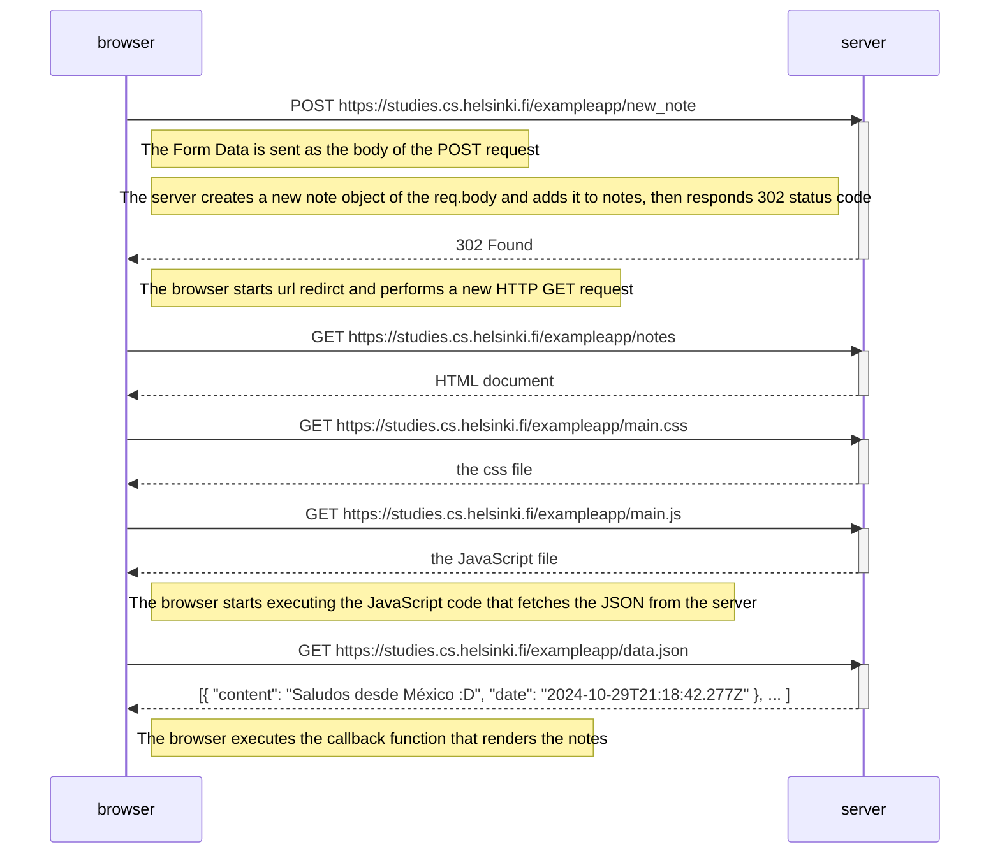

```mermaid
sequenceDiagram
    participant browser
    participant server

    browser->>server: POST https://studies.cs.helsinki.fi/exampleapp/new_note
    activate server

    Note right of browser: The Form Data is sent as the body of the POST request

    Note left of server: The server creates a new note object of the req.body and adds it to notes, then responds 302 status code

    server-->>browser: 302 Found
    deactivate server

    Note right of browser: The browser starts url redirct and performs a new HTTP GET request

    browser->>server: GET https://studies.cs.helsinki.fi/exampleapp/notes
    activate server
    server-->>browser: HTML document
    deactivate server

    browser->>server: GET https://studies.cs.helsinki.fi/exampleapp/main.css
    activate server
    server-->>browser: the css file
    deactivate server

    browser->>server: GET https://studies.cs.helsinki.fi/exampleapp/main.js
    activate server
    server-->>browser: the JavaScript file
    deactivate server

    Note right of browser: The browser starts executing the JavaScript code that fetches the JSON from the server

    browser->>server: GET https://studies.cs.helsinki.fi/exampleapp/data.json
    activate server
    server-->>browser: [{ "content": "Saludos desde México :D", "date": "2024-10-29T21:18:42.277Z" }, ... ]
    deactivate server

    Note right of browser: The browser executes the callback function that renders the notes
```