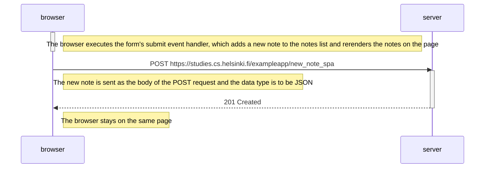

```mermaid
sequenceDiagram
    participant browser
    participant server

    activate browser
    
    Note right of browser: The browser executes the form's submit event handler, which adds a new note to the notes list and rerenders the notes on the page

    deactivate browser

    browser->>server: POST https://studies.cs.helsinki.fi/exampleapp/new_note_spa
    activate server

    Note right of browser: The new note is sent as the body of the POST request and the data type is to be JSON

    server-->>browser: 201 Created
    deactivate server

    Note right of browser: The browser stays on the same page
```